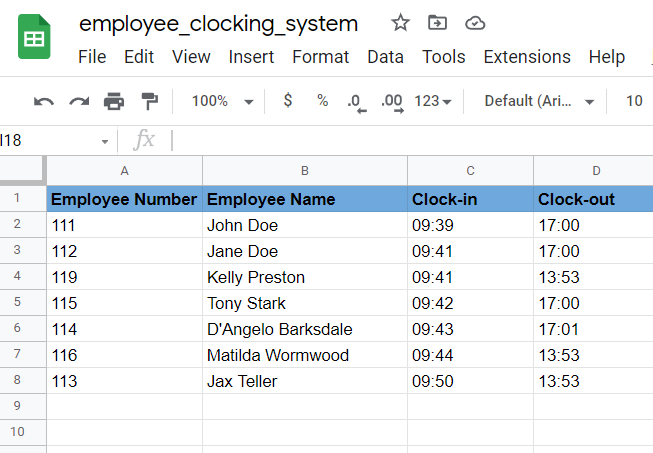
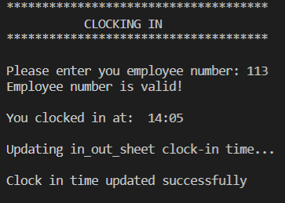
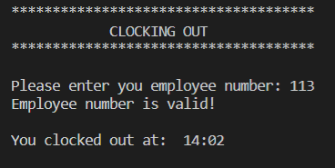
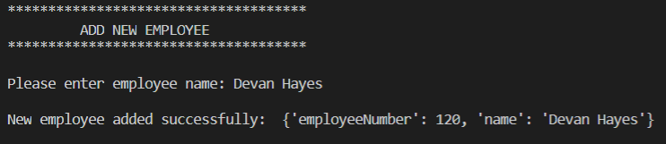

# Employee Clock in System
(Developer: Devan Hayes)

## Project Goals
Employee Clock In System is a program that allows employees of a business to clock in and out. This facilitates the owners with the necessary data they need to track the employees' hours.

## User Experience
The user first decides which option they would like to do, then a google sheet is updated with the data. 

## Features
### Options Menu
    - The options menu has four options to choose from.
        - Option one allows the user to clock in by entering their employee number.
        - Option two allows the user to clock out.
        - Option three allows the user to add new employees to the list of current employees
        - Option four allows the user to quit running the program.

#### Clock-in (Option One)
    - The clock-in option allows an existing employee to enter their employee number.
    - The nubmer runs through a validation function to check the correct lenght of the number entered.
    - This then creates a new row in the Google Sheet (employee_clocking_system) and inputs the employees number, name and time of clock in.

#### Clock-out (Option Two)
    -The clock-out option allows a user who has already clocked in to add a clock-out time to the row created in the clock-in section (Google Sheets)

#### Create New Employee (Option Three)
    - This option allows the user to add a new employee to the list.
        - First the user is prompted to enter a user name.
        - Next the user is prompted to add the hourly rate of the new employee.
        - Finally the new user is assigned an employee number and a new employee has been successfully added to the list

#### Exit
    - The Exit option allows the user to end the program.

### User Input Validation 
    - The input validation checks has the user entered the correct amount of digits.
    - If the incorrect amount of digits is entered the user an error message will be displayed in the terminal

### Languages
- Python 3

### Frameworks and Tools
- gitHub
- Gitpod
- Git

### Testing

| **Feature** | **Action** | **Expected Result** | **Actual Result** |
|-------------|------------|---------------------|-------------------|
|Options Menu| Choose all options one by one| That the option selected by the user would execute.| As expected |

